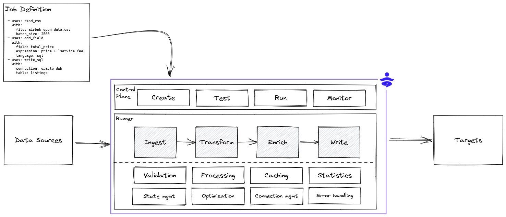
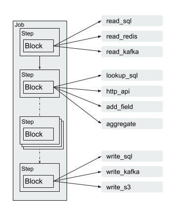

# Introduction

DataYoga is a framework for building and running streaming or batch data pipelines. DataYoga uses low-code to easily define data pipelines using a declarative markup language using yaml files.

## Concepts

`Job` - A Job is composed of a series of `Steps` that reads information from a source, performs transformations, and write to a target. Many sources and targets are suported, including relational databases, non relational databases, file formats, cloud storage, and HTTP servers.

`Step` - Each Step runs a `Block` that uses specific business logic. The output of each Step is fed into the next Step, creating a chain of transformations.

`Blocks` - The Block defines the business logic. Blocks can:

- Read and write from relational and non relational databases
- Read, write, and parse data from local storage and cloud storage
- Perform transformations, modify structure, add computed fields, rename fields, or remove fields
- Enrich data from external sources and APIs

## DataYoga Runtime

DataYoga provides a standalone stream processing engine, the DataYoga Runtime that validates and run Transformation Jobs. The Runtime provides:

- Validation
- Error handling
- Metrics and observability
- Credentials management

The Runtime supports multiple stream [processing strategies](processing-strategies.md) including buffering and rate limiting.
It supports both async processing, multi-threading, and multi-processing to enable maximum throughput with a low footprint.

Read the guide for a more detailed tutorial or check out the reference to see various blocks types currently available.
