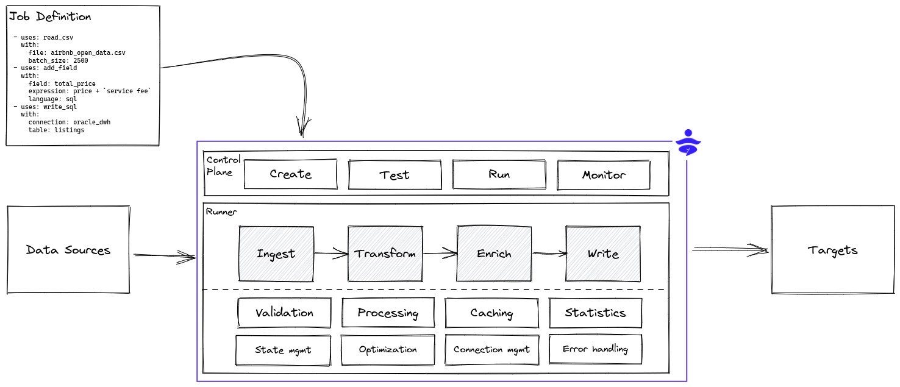
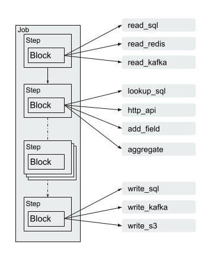

# Introduction

DataYoga is a framework for building and running streaming or batch data pipelines. DataYoga uses low-code to easily define data pipelines using a declarative markup language using YAML files.



## Concepts



`Job` - A Job is composed of a series of `Steps` that reads information from a source, performs transformations, and write to a target. Many sources and targets are supported, including relational databases, non relational databases, file formats, cloud storage, and HTTP servers.

`Step` - Each Step runs a `Block` that uses specific business logic. The output of each Step is fed into the next Step, creating a chain of transformations.

`Blocks` - The Block defines the business logic. Blocks can:

- Read and write from relational and non relational databases
- Read, write, and parse data from local storage and cloud storage
- Perform transformations, modify structure, add computed fields, rename fields, or remove fields
- Enrich data from external sources and APIs

## DataYoga Runtime

DataYoga provides a standalone stream processing engine, the DataYoga Runtime that validates and run Transformation Jobs. The Runtime provides:

- Validation
- Error handling
- Metrics and observability
- Credentials management

The Runtime supports multiple stream [processing strategies](docs/processing-strategies.md) including buffering and rate limiting.
It supports both async processing, multi-threading, and multi-processing to enable maximum throughput with a low footprint.

## Quickstart

```bash
pip install datayoga
```

Verify that the installation completed successfully by running this command:

```bash
datayoga --version
```

## Create New DataYoga Project

To create a new DataYoga project, use the `init` command:

```bash
datayoga init hello_world
cd hello_world
```

> [Directory structure](docs/directory-structure.md)

## Run Your First Job

Let's run our first job. It is pre-defined in the samples folder as part of the `init` command:

```bash
datayoga run sample.hello
```

If all goes well, you should see some startup logs, and eventually:

```yaml
{"id": "1", "fname": "john", "lname": "doe", "credit_card": "1234-1234-1234-1234", "country_code": "972", "country_name": "israel", "gender": "M", "full_name": "John Doe", "greeting": "Hello Mr. John Doe"}
{"id": "2", "fname": "jane", "lname": "doe", "credit_card": "1000-2000-3000-4000", "country_code": "972", "country_name": "israel", "gender": "F", "full_name": "Jane Doe", "greeting": "Hello Ms. Jane Doe"}
{"id": "3", "fname": "bill", "lname": "adams", "credit_card": "9999-8888-7777-666", "country_code": "1", "country_name": "usa", "gender": "M", "full_name": "Bill Adams", "greeting": "Hello Mr. Bill Adams"}
```

That's it! You've created your first job that loads data from CSV, runs it through a series of transformation steps, and shows the data to the standard output. A good start. Read on for a more detailed tutorial or check out the [reference](docs/reference/blocks.md) to see the different block types currently available.
