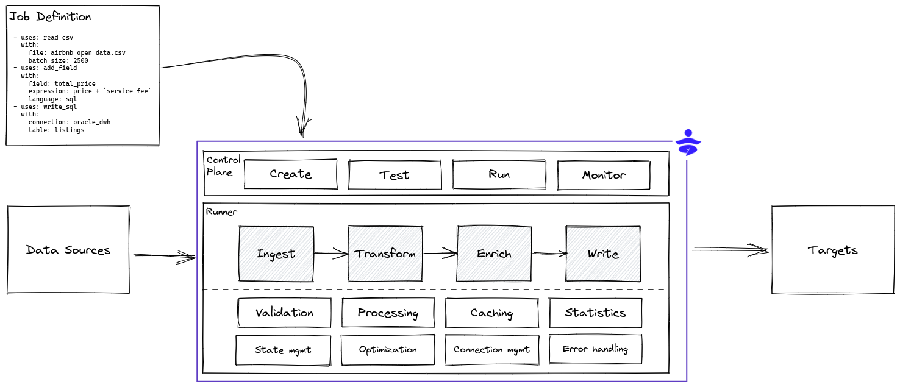

# Introduction

DataYoga is a framework for building and running streaming or batch data pipelines. The DataYoga CLI helps define and deploy data pipelines using a declarative markup language using YAML files.

DataYoga runs Transformation Jobs that read or react to incoming data. Each Transformation Job contains a series of Transformation Steps. Steps can produce data, transform data, or output data to external sources. For example, a Step can read data from a Kafka source, or add a calculated field, or enrich data using a Twitter API. A Step can perform NLP analysis on text to identify sentiment using an AI model, or write data to a data lake on S3 in Parquet format.

Each Transformation Step uses a Processor Block that can perform a wide variety of actions.

DataYoga provides a collection of Blocks that can:

- Read and write from relational and non relational databases
- Read, write, and parse data from local storage and cloud storage
- Perform transformations, modify structure, add computed fields, rename fields, or remove fields
- Enrich data from external sources and APIs

DataYoga provides a standalone stream processing engine, the DataYoga Runtime that validates and run Transformation Jobs. The Runtime provides:

- Validation
- Error handling
- Metrics and observability
- Credentials management

The Runtime supports multiple stream [processing strategies](processing-strategies.md) including:

- Stream processing
- Parallelism
- Buffering
- Rate limit

It supports both async processing, multi-threading, and multi-processing to enable maximum throughput with a low footprint.
