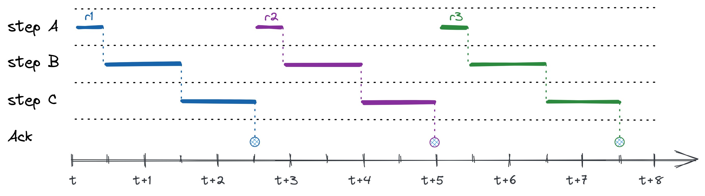
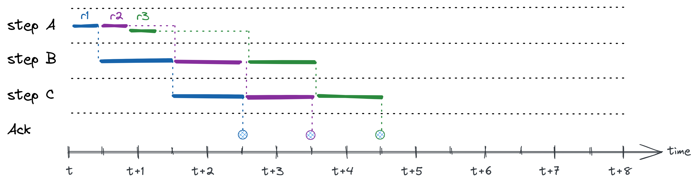
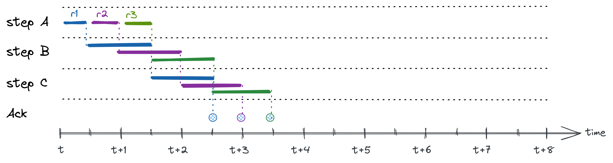
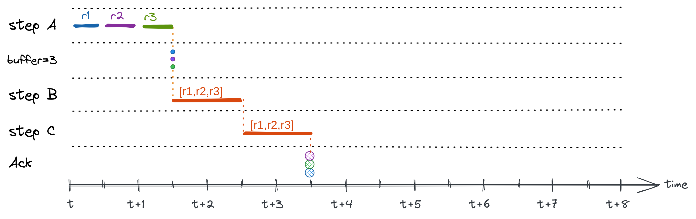

# Processing Strategies

Stream processing enables to process real-time data from a variety of sources. Unlike traditional batch ETL, stream processing deals with continuous processing of a never ending stream of data.

This introduces new challenges and opportunities for optimization to reduce the mean-time-to-process (MTTP) and increase throughput. Many considerations are taken into account when deciding on which processing strategy to use, based on the characteristics of the input sources, the data transformation, and the output targets. DataYoga's modular Transformation Jobs allow to mix processing strategies for each Transformation Step.

The examples below assume that records flow through a Job with 3 Steps, marked as A, B, and C. r1, r2, and r3 mark the data records in the dataset.
The Steps are defined as follows:

- Step A - takes 0.5s to complete
- Step B- takes 1s to complete
- Step C - takes 1s to complete

## Synchronous Sequential Processing

In sequential processing, each record (or a batch of records) passes through each of the Steps. The second record waits for the first to finish. In this example, each record would take 2.5 seconds to complete, showing a total of 7.5 seconds to process the dataset.



## Continuous Sequential Processing

Continuous sequential processing allows to increase throughput by allowing each Step to start processing the next request once the current request's Step processing is complete. This relies on asynchronous processing and allows to parallelize the operation of all Steps while maintain strict order of processing. Only one record is processed per each Step at any given moment.

In our example, we can reduce the processing time of the dataset to 4.5 seconds.



## Parallel Processing

Parallel processing allows to process more than one record within a transformation Step at the same time. Each Step can have a different degree of parallelism. By default, Parallelism uses an asynchronous event loop to maximize performance. However, in case of CPU-bound activities, parallelism can also be performed using multiple OS processes. In case a Step reaches its maximum parallelism, backpressure will be applied to pause upstream Steps from producing additional activity until a slot frees up within the congested Step.
In this example, a parallel setting of 2 has been applied to steps B and C, while step A only processes one record at a time (parallelism of 1). These settings reduce the time to process the dataset to 3.5 seconds.



## Sharded Parallel Processing

Parallel processing can dramatically increase performance. However, if ordering of events is important, Parallel processing may cause issues due to race conditions and out-of-order events. For example, when processing change events, we may end up with an 'insert' operation that accidentally precedes a 'delete' or vice versa.

Sharded Parallel Processing allows to define a sharding key that will ensure that all events relating to the same key will be processed by the same processing instance. This allows to maintain order of events per key, while still allowing parallel processing.

## Buffering

In some cases, batch processing may be more efficient than handling individual records. For example, bulk insert into relational database can be up to x100 more performant than individual inserts. In other cases, we encounter a limit of the number of calls we can perform (see also 'rate limit' below) and can group multiple calls in one batch call. In these cases, it is preferable to add a Buffering capability into the Job. Buffering groups together a group of records. The downstream Steps are presented with the group as the input.

In this example, a buffer size of 3 was applied, and is assumed that Step B and C can handle batches as well as individual records.



## Buffering with Flush Interval

When using buffering, we need to add a mechanism that will allow incomplete buffer to be sent out periodically to avoid a case where buffered records linger for too long. Using a flush interval, buffers will be sent downstream every interval regardless of the size of the accumulated buffer.

In this example, a buffer size of 3 was applied, and a flush interval of 1 second.


## Rate Limit

Rate limit allows to set guards for the frequency of processing in a given time frame. This is useful, for example, in cases of working with external APIs to avoid creating a 'denial of service' or to meet API usage limits by the API provider.

The Rate limit strategy defines the number of requests per given time interval. For example, 5 requests a minute. When the limit is reached, processing for this Step will pause until the time period elapses to allow additional calls.

## Producer Batching

Every producer block (any block that reads from a source — `std/read`, `files/read_csv`, `parquet/read`, `relational/read`, `redis/read_stream`, `azure/read_event_hub`, `http/receiver`) accepts a `batch_size` property. The producer base class re-chunks the source's output into batches of exactly `batch_size` records, regardless of how the source delivers them (per row, per row group, per `fetchmany`, per network message).

```yaml
input:
  uses: files.read_csv
  with:
    file: people.csv
    batch_size: 500 # downstream steps process 500 records per call
```

Default: `1000`.

### Streaming producers and `flush_ms`

Streaming producers (`redis/read_stream`, `azure/read_event_hub`, `http/receiver`) also accept `flush_ms`. If no new records arrive within that many milliseconds, any partial batch is flushed downstream instead of being held until `batch_size` is reached.

```yaml
input:
  uses: redis.read_stream
  with:
    connection: my_redis
    stream_name: events
    batch_size: 1000
    flush_ms: 500 # emit a partial batch after 500ms of inactivity
```

Default: `1000` ms. Set to `null` to disable time-based flushing (records are held until `batch_size` or end-of-stream).

### `relational/read` and `fetch_size`

`relational/read` exposes an extra `fetch_size` property that controls how many rows are pulled from the database driver per round-trip, independent of the pipeline `batch_size`. Default: `10000`. Tune lower for memory pressure with wide rows; tune higher if you want fewer DB round-trips and downstream processing is the bottleneck.

### `azure/read_event_hub` migration note

In earlier versions, `batch_size` on `azure/read_event_hub` controlled the SDK callback batch size, not the pipeline batch size. As of #400 it has been renamed to `max_batch_size` to match the SDK semantic, and `batch_size` now consistently means pipeline batch size as it does for every other producer.

## Mix and Match

The processing strategies can be mixed to fit the specific use case. For example, reading records from a Stream one by one, pushing into a parallel processor to perform a transformation, batched and fanned out to multiple processes to load into a relational database in bulk
